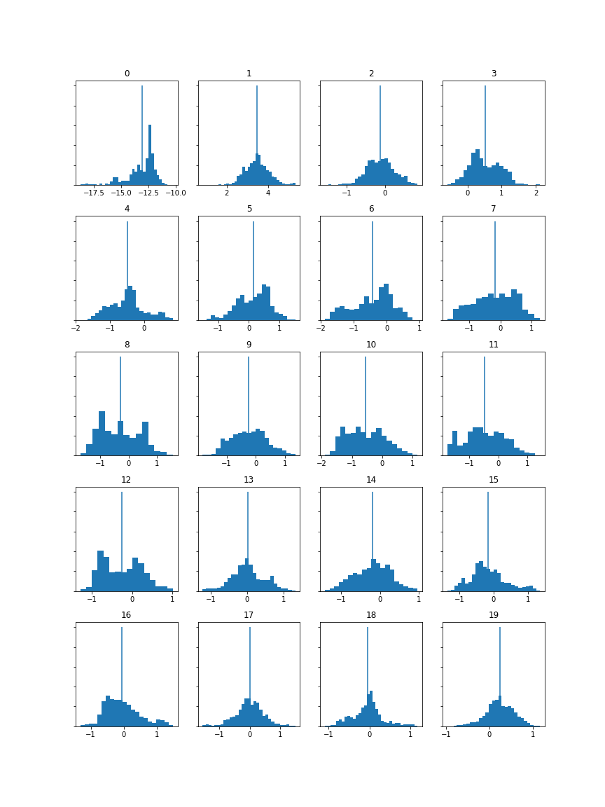
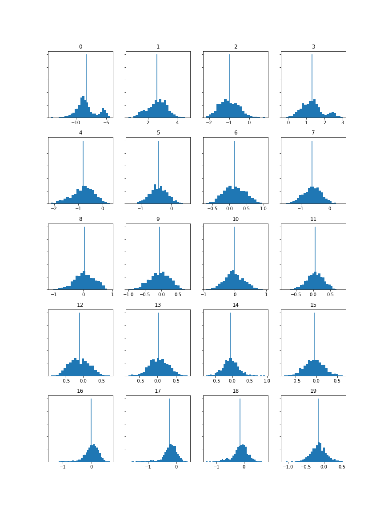
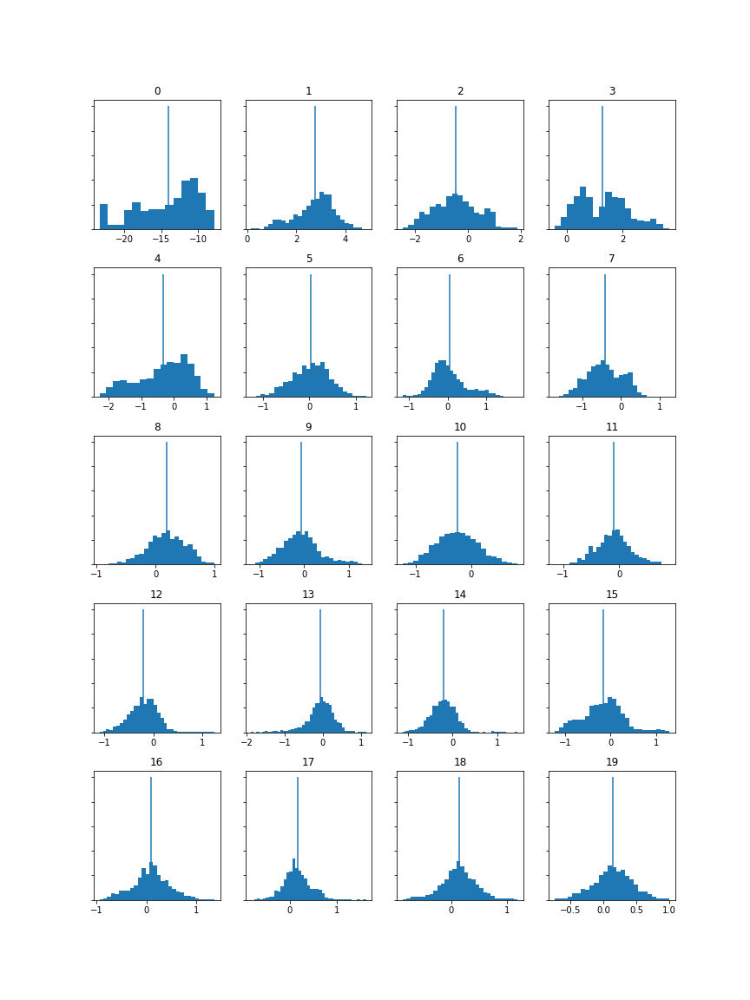
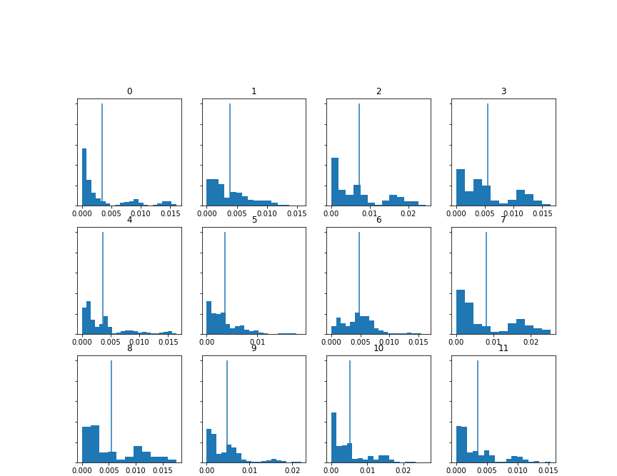
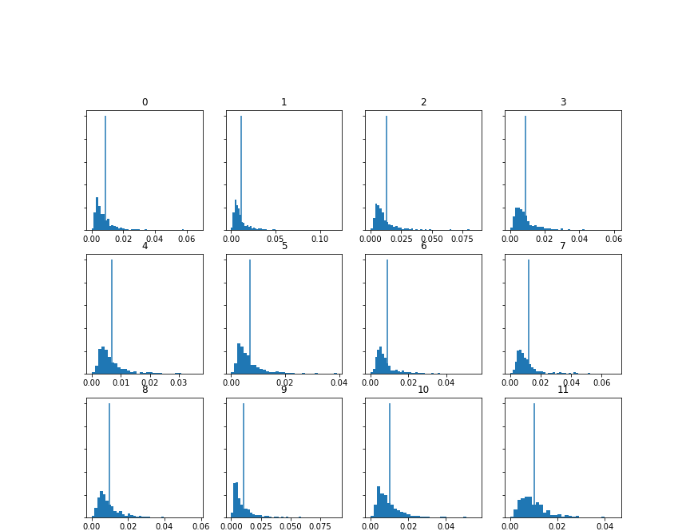
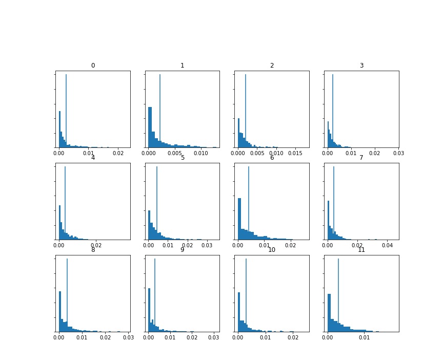
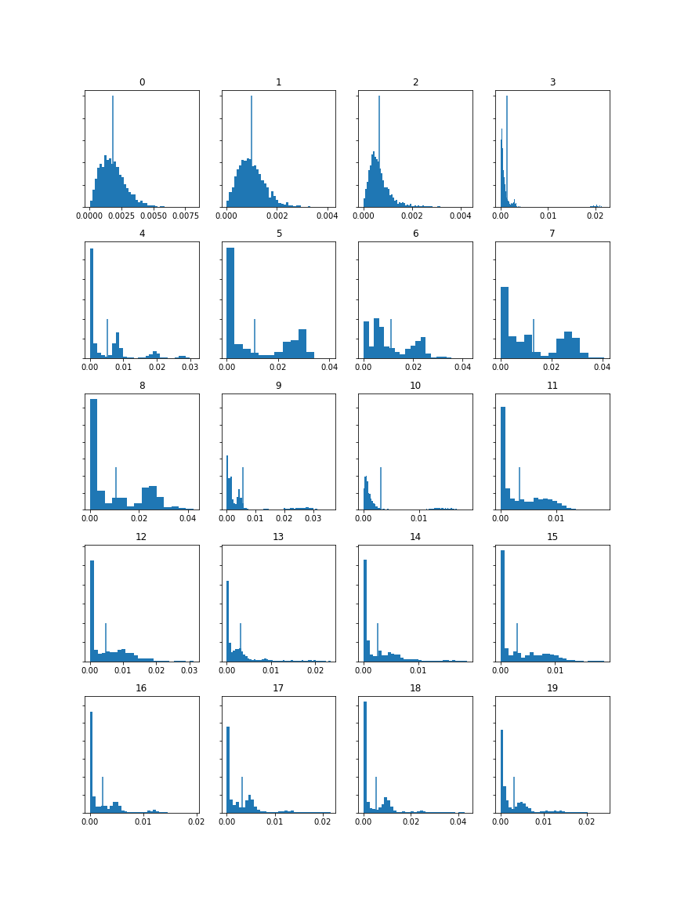
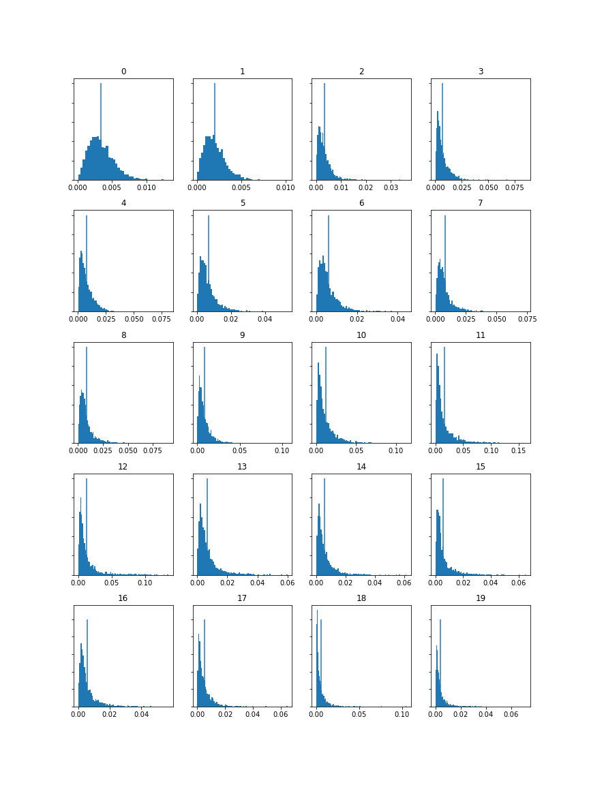
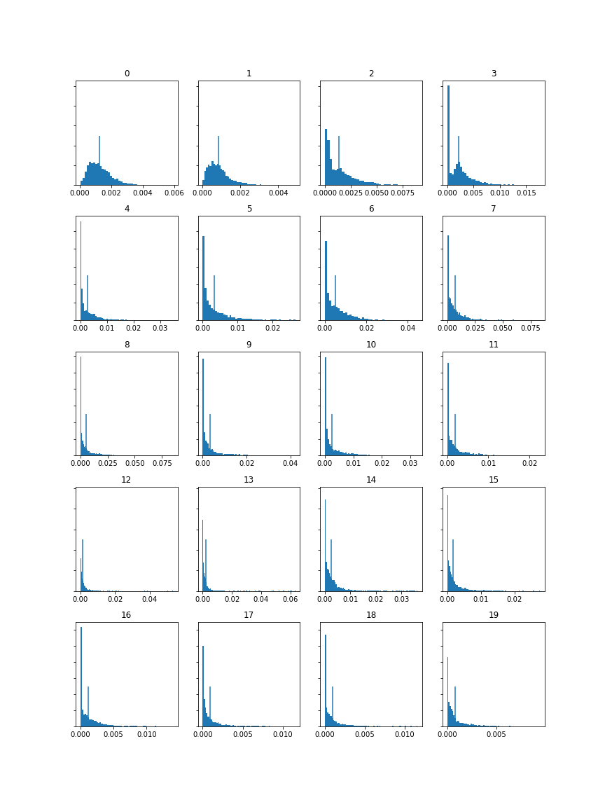

[Week 1](https://olliecargill.github.io/MCA-2022) | [Week 2](https://olliecargill.github.io/MCA-2022/labtasks/week2/week2.html) | [Week 3](https://olliecargill.github.io/MCA-2022/labtasks/week3/week3.html) | [Week 4](https://olliecargill.github.io/MCA-2022/labtasks/week4/week4.html) | [Week 5](https://olliecargill.github.io/MCA-2022/labtasks/week5/week5.html) | [Week 7](https://olliecargill.github.io/MCA-2022/labtasks/week7/week7.html) | [Week 8](https://olliecargill.github.io/MCA-2022/labtasks/week8/week8.html) | [Week 9](https://olliecargill.github.io/MCA-2022/labtasks/week9/week9.html) | [Week 10](https://olliecargill.github.io/MCA-2022/labtasks/week10/week10.html)

# Ollie Cargill's MCA Project: Medieval Music

## Week 1: Basics of Music Data
Some issues that can arise when working with medieval music and its data can be preservation and accessibility. Preservation is especially relevant to medieval music, particularly concerning access to manuscripts. Handwritten manuscripts from the medieval period can be fragile, tattered and often elusive due to deterioration over time. Solutions to this include good preservation practises which can mitigate further degradation, and restoration methods. Digitising the manuscripts is a solution for both preservation and accessibility, as in a digital form, the manuscripts are easier to analyse as there is no risk of damage to the original copy. In terms of accessibility, digitised manuscripts can be uploaded to an online archive and therefore can be widely accessible. Medieval music is presently curated in manuscript form in archives, museums and databases. These online archives and databases contain metadata about the manuscript (some of this metadata is estimated because information is lost through time) like place of writing, time period of production, the contents of the manuscript, the archive where the physical manuscript is held, the dimensions of the manuscripts and so on. The [DIAMM](https://www.diamm.ac.uk/) (Digital Image Archive of Medieval Music) is an example of an online database for medieval music information and digitised manuscripts.

## Week 8: Music as Sound

The three tracks I have selected are from the album <i>Thirteenth-Century Polyphony (Early Medieval Music)</i> available from: https://archive.org/details/lp_thirteenth-century-polyphony-early-medieva_archibald-t-davison-willi-apel-the-univers/disc1/02.05.+Aucun+%E2%80%92+Lonc+Tans+%E2%80%92+Annuntiantes+(de+Cruce).mp3

I selected the tracks titled <i>Hec Dies (3-voice Organum), Aucun - Lonc Tans - Annuntiantes (de Cruce) and Monophonic Dances: Danse Royale; Danse Royale; English Dance.</i> I thought it would be interesting to see how an organum would look in SonicVisualiser compared to a monophonic piece, hence why I have selected these two specifically. <i>Aucun</i> was selected because it features both voice and instrument, whereas the others feature solely instruments or solely voice. I thought it would be interesting to pick three varied pieces.  

### Hec Dies

#### Metadata

Feature | Value
------- | ------
Title | Hec Dies (3-voice Organum)
Artist | Steven Crockett, Robert Heinrickson, Roger Weiss
Composer | Leonin (unconfirmed)
Copyright Info | ℗ 1975 Southern Illinois University Press
Genre | Early Medieval, a cappella 
Source | [archive.org](https://archive.org/details/lp_thirteenth-century-polyphony-early-medieva_archibald-t-davison-willi-apel-the-univers/disc1/01.13.+Hec+Dies+(3-voice+Organum).mp3)
File/Audio Format | mp3 (originally an LP)
Number of Channels | 2
Sample Rate | 48000Hz
Bits per Second | 171kbps
Duration | 00:30

#### Waveform

#### Spectrogram

### Aucun

#### Metadata

Feature | Value
------- | ------
Title | Aucun - Lonc Tans - Annuntiantes (de Cruce)
Artist | Robert Heinrickson, Howard M. Brown, David Eisenbud
Composer | Petrus de Cruce
Copyright Info | ℗ 1975 Southern Illinois University Press
Genre | Early Medieval, song 
Source | [archive.org](https://archive.org/details/lp_thirteenth-century-polyphony-early-medieva_archibald-t-davison-willi-apel-the-univers/disc1/02.05.+Aucun+%E2%80%92+Lonc+Tans+%E2%80%92+Annuntiantes+(de+Cruce).mp3)
File/Audio Format | mp3 (originally an LP)
Number of Channels | 2
Sample Rate | 48000Hz
Bits per Second | 174kbps
Duration | 00:30

#### Waveform

#### Spectrogram

### Monophonic Dances

#### Metadata

Feature | Value
------- | ------
Title | Monophonic Dances: Danse Royale; Danse Royale; English Dance
Artist | Howard M. Brown, Benjamin Choi, Laurence Libin, Anne MacWilliams, Michael Shapiro, Helen Walker
Composer | Unknown
Copyright Info | ℗ 1975 Southern Illinois University Press
Genre | Early Medieval, Instrumental, Dance
Source | [archive.org](https://archive.org/details/lp_thirteenth-century-polyphony-early-medieva_archibald-t-davison-willi-apel-the-univers/disc1/02.13.+Monophonic+Dances%3A+Danse+Royale%3B+Danse+Royale%3B+English+Dance.mp3)
File/Audio Format | mp3 (originally an LP)
Number of Channels | 2
Sample Rate | 48000Hz
Bits per Second | 174kbps
Duration | 00:30

#### Waveform

#### Spectrogram

One advantage of a time-frequency analysis over a waveform-based analysis is that time-frequency analyses are easier to read and thus gather information from. They are more comprehensible than waveforms, which tend to be difficult to extract information from at a glance, as they are extremely information dense. From an initial look at a waveform, one might only be able to determine how loud the audio is at certain points from the height of the waves, and how this changes throughout the song. However, a spectrogram can provide more information on pitch for example. If we look at the example from <i>Monophonic Dances</i> we can see from the waveform that there is repetition in the song, as a pattern can be seen in the waves. However, anything beyond the fact that there is a pattern and the dynamics is unknown from looking at the waveform. If we look at the spectrogram, this pattern is visable like in the waveform, but the Y-axis tells us the frequency, and therefore we can determine the relevant pitch. So from a time-frequency analysis we can work out melody and perhaps the key of the piece, giving us more information than a waveform. 

## Week 9: Analysing and Extracting Meaning from Audio

For this week's task I selected three sample tracks from the album <i>Music for a Medieval Day</i> available from [archive.org](https://archive.org/details/lp_music-for-a-medieval-day_alfonso-x-el-sabio-anonymous-guillaume-de/disc1/01.10.+Sumer+Is+Icumin+In.mp3) The tracks I have selected are: <i>Douce Dame Jolie</i>, <i>De Triste Cuer</i> and <i>Sumer is Icumin In</i>.

### Douce Dame Jolie

#### Spectrogram, Chromagram and MFCC

#### CSV files

[Spectrogram](doucespectrogram.csv)
[Chromagram](doucechromagram.csv)
[MFCC](doucemfcc.csv)

### De Triste Cuer

#### Spectrogram, Chromagram and MFCC

#### CSV files

[Spectrogram](detristespectrogram.csv)
[Chromagram](detristechromagram.csv)
[MFCC](detristemfcc.csv)

### Sumer is Icumin In

#### Spectrogram, Chromagram and MFCC

#### CSV files

[Spectrogram](sumerspectrogram.csv)
[Chromagram](sumerchromagram.csv)
[MFCC](sumermfcc.csv)

### Histograms 

I then created histograms of the MFCCs, chromograms and spectrograms of each piece using Jupyter Notebooks. Here are the histograms:

#### MFCCs

#### Chromagrams

#### Spectrograms

