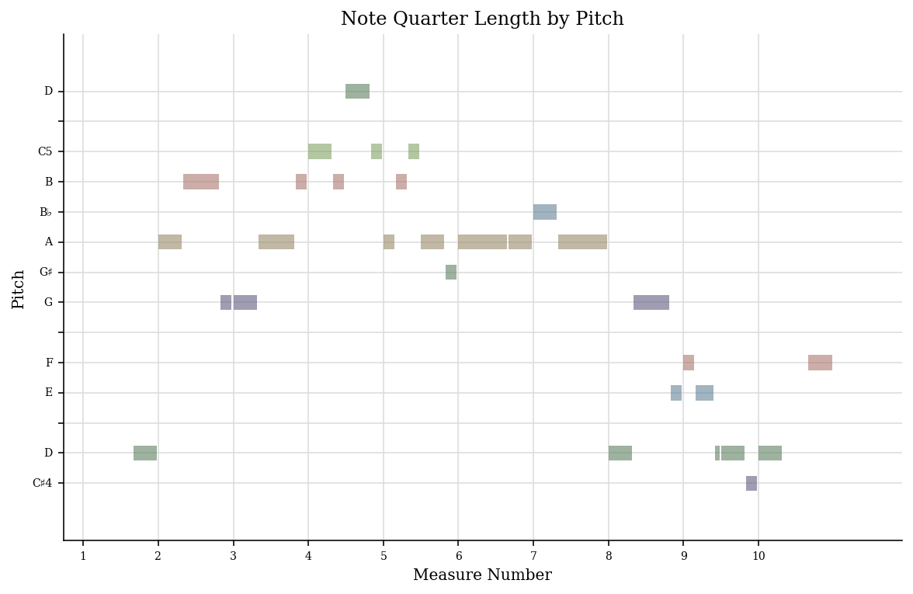

# Ollie Cargill's MCA Project

## Week 1: Basics of Music Data
Some issues that can arise when working with medieval music and its data can be preservation and accessibility. Preservation is especially relevant to medieval music, particularly concerning access to manuscripts. Handwritten manuscripts from the medieval period can be fragile, tattered and often elusive due to deterioration over time. Solutions to this include good preservation practises which can mitigate further degradation, and restoration methods. Digitising the manuscripts is a solution for both preservation and accessibility, as in a digital form, the manuscripts are easier to analyse as there is no risk of damage to the original copy. In terms of accessibility, digitised manuscripts can be uploaded to an online archive and therefore can be widely accessible. Medieval music is presently curated in manuscript form in archives, museums and databases. These online archives and databases contain metadata about the manuscript (some of this metadata is estimated because information is lost through time) like place of writing, time period of production, the contents of the manuscript, the archive where the physical manuscript is held, the dimensions of the manuscripts and so on. The [DIAMM](https://www.diamm.ac.uk/) (Digital Image Archive of Medieval Music) is an example of an online database for medieval music information and digitised manuscripts.

## Week 2: Notation Basics 
For week 2's task, I converted a PDF file of the sheet music for the medieval hymn "Ave Maris Stella" in to MuseScore. I then corrected any mistakes that the technology made in the conversion process. Here is a screenshot of the PDF converted into Musescore:

I noticed a reccurring issue that arised when converting the PDF to Musescore. This was that the stems joining quavers together were sometimes broken instead of connected. The music is still readable and makes sense, so this is more of a stylistic issue. 

## Week 3: Encoding Basics for Notation

For week 3's task, I exported this MuseScore file into MusicXML and MEI, and then rendered the MEI file using Verovio.
Here is the [MusicXML file.](https://github.com/OllieCargill/MCA-2022/blob/master/Ave_Maris_Stella.musicxml)

This is the link to the rendered MEI file of Ave Maris Stella using Verovio - my answers to the week 3 questions are also on this page.

[Weeks 2 & 3 Task](https://olliecargill.github.io/MCA-2022/verovio.html)

## Week 4: Computational Analytics of Notated Music
For this week's task, I generated a jSymbolic analysis of Ave Maris Stella. I selected a number of features to analyse and opened these in an Excel file to view them. Here is a screenshot of the Excel file showing the jSymbolic analysis.

Here are the findings:

Feature | Value
------- | -------
Number of pitches | 28
Number of pitch classes | 12
Range | 31
Strong tonal centres | 1
Mean pitch | 60.92
Mean pitch class | 5.198
Most common pitch | 62 
Most common pitch class | 2
Interval between most prevelant pitches | 5
Pitch variability | 6.927
Most common melodic interval | 2

From these findings I know that the most common pitch is a D4, as the MIDI value for D4 is 62. 

I then created a piano roll, scattergraph and pitch histogram of the piece using music21. 

## Week 5: Standards in Curation
For this week's task, I added metadata to my MEI file. 
The first element I chose to add was a title using the <i>title</i> element.  
The second element I chose to add was a subtitle. I used the <i>title</i> element with the <i>type="subtitle"</i> attribute.
The third element I chose to add was author.
The fourth element I chose to add was composer.
The final element I chose to add

