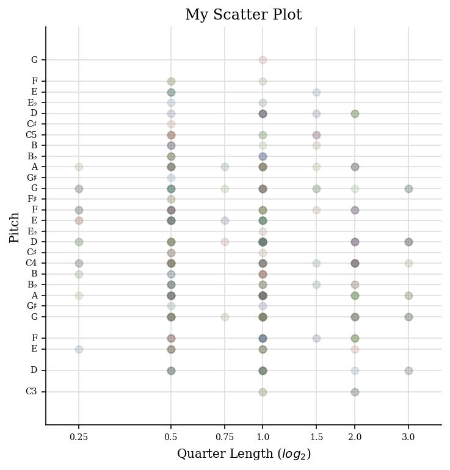
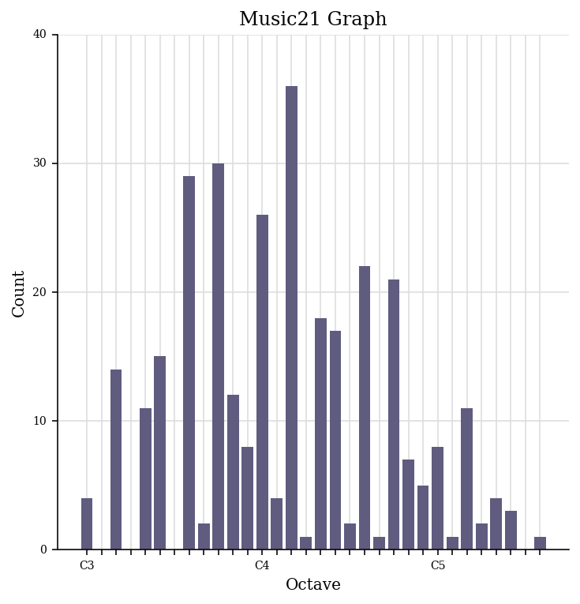
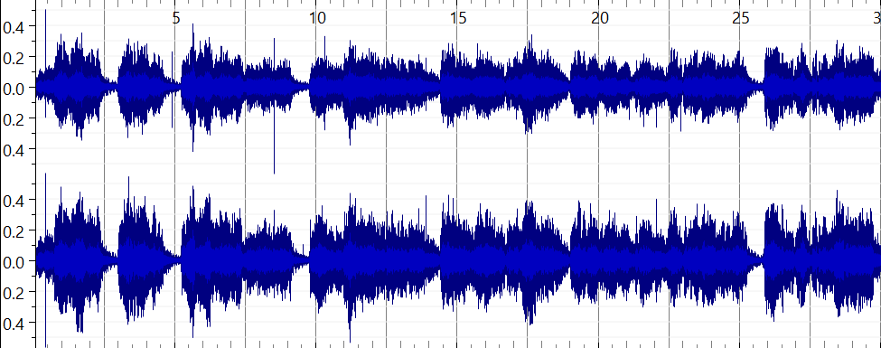
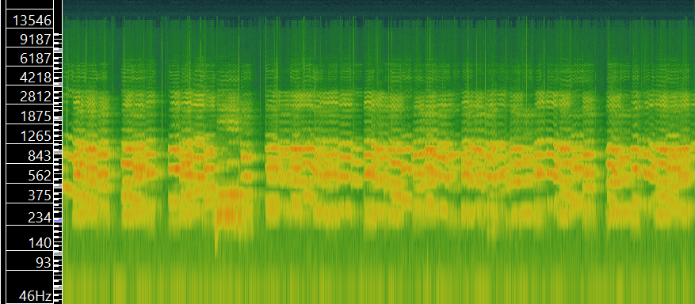
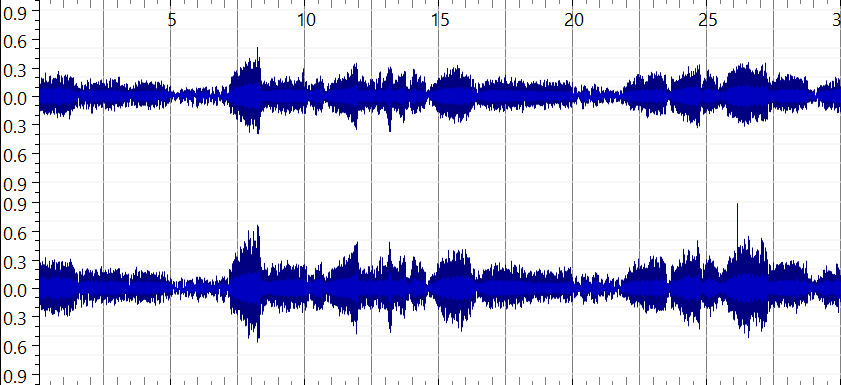
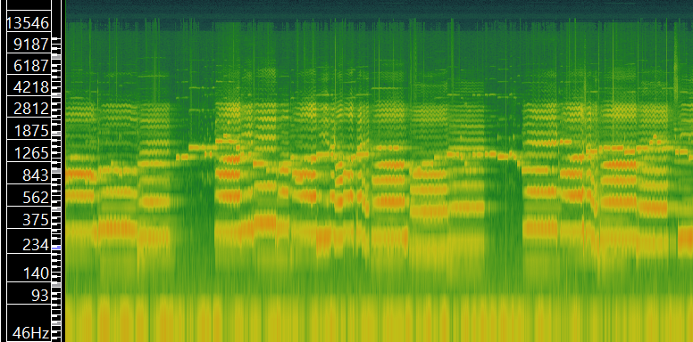
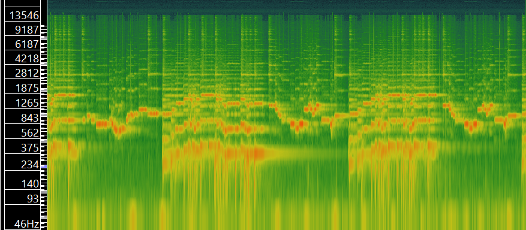
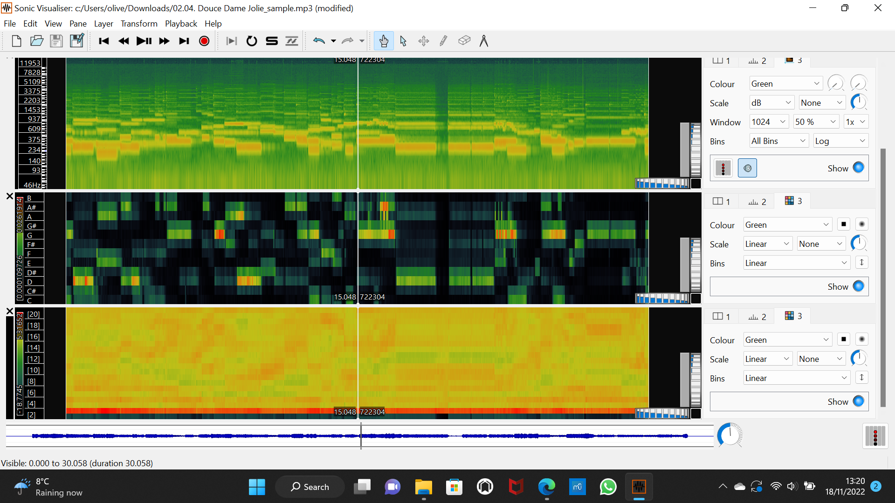
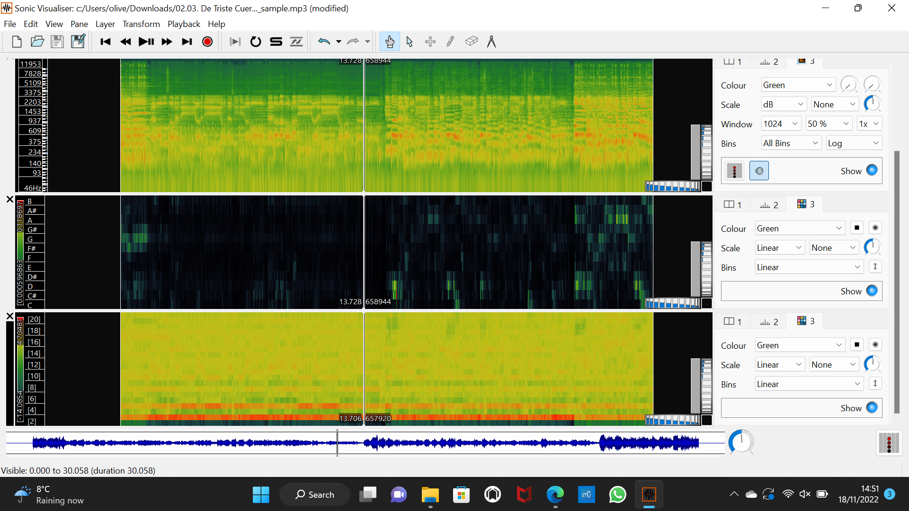
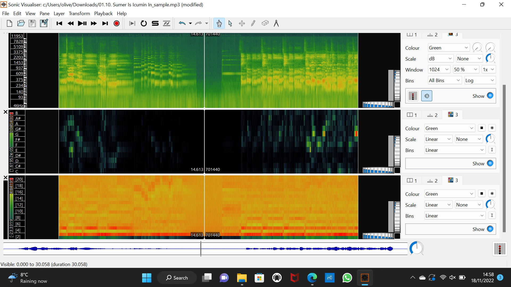

# Ollie Cargill's MCA Project: Medieval Music

## Week 1: Basics of Music Data
Some issues that can arise when working with medieval music and its data can be preservation and accessibility. Preservation is especially relevant to medieval music, particularly concerning access to manuscripts. Handwritten manuscripts from the medieval period can be fragile, tattered and often elusive due to deterioration over time. Solutions to this include good preservation practises which can mitigate further degradation, and restoration methods. Digitising the manuscripts is a solution for both preservation and accessibility, as in a digital form, the manuscripts are easier to analyse as there is no risk of damage to the original copy. In terms of accessibility, digitised manuscripts can be uploaded to an online archive and therefore can be widely accessible. Medieval music is presently curated in manuscript form in archives, museums and databases. These online archives and databases contain metadata about the manuscript (some of this metadata is estimated because information is lost through time) like place of writing, time period of production, the contents of the manuscript, the archive where the physical manuscript is held, the dimensions of the manuscripts and so on. The [DIAMM](https://www.diamm.ac.uk/) (Digital Image Archive of Medieval Music) is an example of an online database for medieval music information and digitised manuscripts.

## Week 2: Notation Basics 
For week 2's task, I converted a PDF file of the sheet music for the medieval hymn "Ave Maris Stella" in to MuseScore. I then corrected any mistakes that the technology made in the conversion process. Here is a screenshot of the PDF converted into Musescore:

I noticed a reccurring issue that arised when converting the PDF to Musescore. This was that the stems joining quavers together were sometimes broken instead of connected. The music is still readable and makes sense, so this is more of a stylistic issue. 

## Week 3: Encoding Basics for Notation

For week 3's task, I exported this MuseScore file into MusicXML and MEI, and then rendered the MEI file using Verovio.
Here is the [MusicXML file.](https://github.com/OllieCargill/MCA-2022/blob/master/Ave_Maris_Stella.musicxml)

This is the link to the rendered MEI file of Ave Maris Stella using Verovio - my answers to the week 3 questions are also on this page.

[Week 3 Task](https://olliecargill.github.io/MCA-2022/verovio.html)

## Week 4: Computational Analytics of Notated Music
For this week's task, I generated a jSymbolic analysis of Ave Maris Stella. I selected a number of features to analyse and opened these in an Excel file to view them. Here is a screenshot of the Excel file showing the jSymbolic analysis.

Here is a link to the [csv file](Ave_Maris_Stella_jSymbolic_VALUES.csv)

Here are the findings:

Feature | Value
------- | -------
Number of pitches | 28
Number of pitch classes | 12
Range | 31
Strong tonal centres | 1
Mean pitch | 60.92
Mean pitch class | 5.198
Most common pitch | 62 
Most common pitch class | 2
Interval between most prevelant pitches | 5
Pitch variability | 6.927
Most common melodic interval | 2

Some conclusions we can draw from this information are:the most common pitch is a D4, as the MIDI value for D4 is 62. This is reflected in the pitch histogram further down, which also shows that D4 is the most common pitch. We also know that there are 31 semitones between the highest and the lowest pitch in the piece, as demonstarted by the Range feature. We also know that the most common distance between two notes is 2 semitones. The 'most common melodic interval' feature tells us this.

I then created a piano roll, scatterplot and pitch histogram of the piece using music21. 

### Piano roll

This is a piano roll of the first 10 bars or 30 notes of the piece. It shows the order of notes played (reading from left to right), the pitch of the note played (from the Y-axis) and the length of the note played (from the X-axis) over these first 10 bars. 

### Scatterplot

This scatterplot shows the relationship between the pitches in the piece and their lengths. From this we know that the most common note lengths are quarter notes (crotchets) and eighth notes (quavers). This is because the most plots are on the 0.5 and 1.0 values on the X-axis, which represents quarter length notes. The more transparent plots have fewer notes of that pitch that are that length. The more opaque plots have many notes of that pitch are that length. 

### Pitch histogram

This shows the number of pitches in the piece ranging from C3 to G5. From this histogram, we can determine that there are 30 A3s for example. We can also see that there are many Gs, As, Ds and Cs, so this could give us a good indication of the key of the piece which we know is C major. You can also draw an indication on how high or low the piece is from the histogram. By looking at the frequency of pitches, we can see that the piece centres mostly around D4, so is mid-range. The most common pitches range between G3 and A4. This means the piece mostly stays in roughly 1 octave.

## Week 5: Standards in Curation
For this week's task, I added metadata to my MEI file. 
The first element I chose to add was a title using the <i>title</i> element.  
The second element I chose to add was a subtitle. I used the <i>title</i> element with the <i>type="subtitle"</i> attribute.
The third element I chose to add was author.
The fourth element I chose to add was composer.
The final element I chose to add

## Week 7: Challenges to Music Curation

## Week 8: Music as Sound

The three tracks I have selected are from the album <i>Thirteenth-Century Polyphony (Early Medieval Music)</i> available from: https://archive.org/details/lp_thirteenth-century-polyphony-early-medieva_archibald-t-davison-willi-apel-the-univers/disc1/02.05.+Aucun+%E2%80%92+Lonc+Tans+%E2%80%92+Annuntiantes+(de+Cruce).mp3

I selected the tracks titled <i>Hec Dies (3-voice Organum), Aucun - Lonc Tans - Annuntiantes (de Cruce) and Monophonic Dances: Danse Royale; Danse Royale; English Dance.</i> I thought it would be interesting to see how an organum would look in SonicVisualiser compared to a monophonic piece, hence why I have selected these two specifically. <i>Aucun</i> was selected because it features both voice and instrument, whereas the others feature solely instruments or solely voice. I thought it would be interesting to pick three varied pieces.  

### Hec Dies

#### Metadata

Feature | Value
------- | ------
Title | Hec Dies (3-voice Organum)
Artist | Steven Crockett, Robert Heinrickson, Roger Weiss
Composer | Leonin (unconfirmed)
Copyright Info | ℗ 1975 Southern Illinois University Press
Genre | Early Medieval, a cappella 
Source | [archive.org](https://archive.org/details/lp_thirteenth-century-polyphony-early-medieva_archibald-t-davison-willi-apel-the-univers/disc1/01.13.+Hec+Dies+(3-voice+Organum).mp3)
File/Audio Format | mp3 (originally an LP)
Number of Channels | 2
Sample Rate | 48000Hz
Bits per Second | 171kbps
Duration | 00:30

#### Waveform

#### Spectrogram

### Aucun

#### Metadata

Feature | Value
------- | ------
Title | Aucun - Lonc Tans - Annuntiantes (de Cruce)
Artist | Robert Heinrickson, Howard M. Brown, David Eisenbud
Composer | Petrus de Cruce
Copyright Info | ℗ 1975 Southern Illinois University Press
Genre | Early Medieval, song 
Source | [archive.org](https://archive.org/details/lp_thirteenth-century-polyphony-early-medieva_archibald-t-davison-willi-apel-the-univers/disc1/02.05.+Aucun+%E2%80%92+Lonc+Tans+%E2%80%92+Annuntiantes+(de+Cruce).mp3)
File/Audio Format | mp3 (originally an LP)
Number of Channels | 2
Sample Rate | 48000Hz
Bits per Second | 174kbps
Duration | 00:30

#### Waveform

#### Spectrogram

### Monophonic Dances

#### Metadata

Feature | Value
------- | ------
Title | Monophonic Dances: Danse Royale; Danse Royale; English Dance
Artist | Howard M. Brown, Benjamin Choi, Laurence Libin, Anne MacWilliams, Michael Shapiro, Helen Walker
Composer | Unknown
Copyright Info | ℗ 1975 Southern Illinois University Press
Genre | Early Medieval, Instrumental, Dance
Source | [archive.org](https://archive.org/details/lp_thirteenth-century-polyphony-early-medieva_archibald-t-davison-willi-apel-the-univers/disc1/02.13.+Monophonic+Dances%3A+Danse+Royale%3B+Danse+Royale%3B+English+Dance.mp3)
File/Audio Format | mp3 (originally an LP)
Number of Channels | 2
Sample Rate | 48000Hz
Bits per Second | 174kbps
Duration | 00:30

#### Waveform

#### Spectrogram

One advantage of a time-frequency analysis over a waveform-based analysis is that time-frequency analyses are easier to read and thus gather information from. They are more comprehensible than waveforms, which tend to be difficult to extract information from at a glance, as they are extremely information dense. From an initial look at a waveform, one might only be able to determine how loud the audio is at certain points from the height of the waves, and how this changes throughout the song. However, a spectrogram can provide more information on pitch for example. If we look at the example from <i>Monophonic Dances</i> we can see from the waveform that there is repetition in the song, as a pattern can be seen in the waves. However, anything beyond the fact that there is a pattern and the dynamics is unknown from looking at the waveform. If we look at the spectrogram, this pattern is visable like in the waveform, but the Y-axis tells us the frequency, and therefore we can determine the relevant pitch. So from a time-frequency analysis we can work out melody and perhaps the key of the piece, giving us more information than a waveform. 

## Week 9: Analysing and Extracting Meaning from Audio

For this week's task I selected three sample tracks from the album <i>Music for a Medieval Day</i> available from [archive.org](https://archive.org/details/lp_music-for-a-medieval-day_alfonso-x-el-sabio-anonymous-guillaume-de/disc1/01.10.+Sumer+Is+Icumin+In.mp3) The tracks I have selected are: <i>Douce Dame Jolie</i>, <i>De Triste Cuer</i> and <i>Sumer is Icumin In</i>.

### Douce Dame Jolie

#### Spectrogram, Chromagram and MFCC

#### CSV files

[Spectrogram](doucespectrogram.csv)
[Chromagram](doucechromagram.csv)
[MFCC](doucemfcc.csv)

### De Triste Cuer

#### Spectrogram, Chromagram and MFCC

#### CSV files

[Spectrogram](detristespectrogram.csv)
[Chromagram](detristechromagram.csv)
[MFCC](detristemfcc.csv)

### Sumer is Icumin In

#### Spectrogram, Chromagram and MFCC

#### CSV files

[Spectrogram](sumerspectrogram.csv)
[Chromagram](sumerchromagram.csv)
[MFCC](sumermfcc.csv)

### Histograms 

I then created histograms of the MFCCs, chromograms and spectrograms of each piece using Jupyter Notebooks. Here are the histograms:

#### MFCCs

#### Chromagrams

#### Spectrograms

