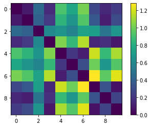
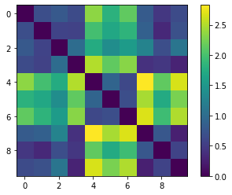

[Week 1](https://olliecargill.github.io/MCA-2022) | [Week 2](https://olliecargill.github.io/MCA-2022/labtasks/week2/week2.html) | [Week 3](https://olliecargill.github.io/MCA-2022/labtasks/week3/week3.html) | [Week 4](https://olliecargill.github.io/MCA-2022/labtasks/week4/week4.html) | [Week 5](https://olliecargill.github.io/MCA-2022/labtasks/week5/week5.html) | [Week 7](https://olliecargill.github.io/MCA-2022/labtasks/week7/week7.html) | [Week 8](https://olliecargill.github.io/MCA-2022/labtasks/week8/week8.html) | [Week 9](https://olliecargill.github.io/MCA-2022/labtasks/week9/week9.html) | [Week 10](https://olliecargill.github.io/MCA-2022/labtasks/week10/week10.html)

# Ollie Cargill's MCA Project: Medieval Music

## Week 10: Audio Similarity and Transcription

### 1. Similarity

* For this week's task I generated a similarity scatterplot and similarity matrix of 10 tracks using Jupyter Notebooks. I replaced the three country tracks with the medieval samples I used in week 8's task. Here are the similiarity matrixes:

<table class ="screenshots">
  <tr>
    <td class="text-table"> A to C Scatterplot</td>
    <td class="text-table"> A to C Similarity Matrix</td>
    <td class="text-table"> All 12 Notes</td>
  </tr>
  <tr>
    <td class="text-table"> </td>
    <td class="text-table"> </td>
    <td class="text-table"> </td>
  </tr>
  </table>
      
* Track 7 represents <strong>Sumer is Icunmin In</strong>, track 8 represents <strong>De Triste Cuer</strong> and track 9 represents <strong>Douce Dame Jolie</strong>.

### 2. Transcription

* For the next task, I used the piece from week 2's task, Ave Maris Stella, to make a piano roll transcription. First, I imported the WAV file into SonicVisualiser and then created a piano roll using <i>Transform</i>. Next, I exported the piano roll as a MIDI file and opened it using MuseScore to visualise it in notational form. Below is the original piece compared to the transcribed piece:

<table class="screenshots">
  <tr>
    <td class="text-table"> Original Score</td>
    <td class="text-table"> Transcribed Piece</td>
  </tr>
  <tr>
    <td class="text-table"> </td>
    <td class="text-table"> </td>
  </tr>
  </table>
       

<a href="https://olliecargill.github.io/MCA-2022/labtasks/week9/week9.html"><--Week 9</a> 
