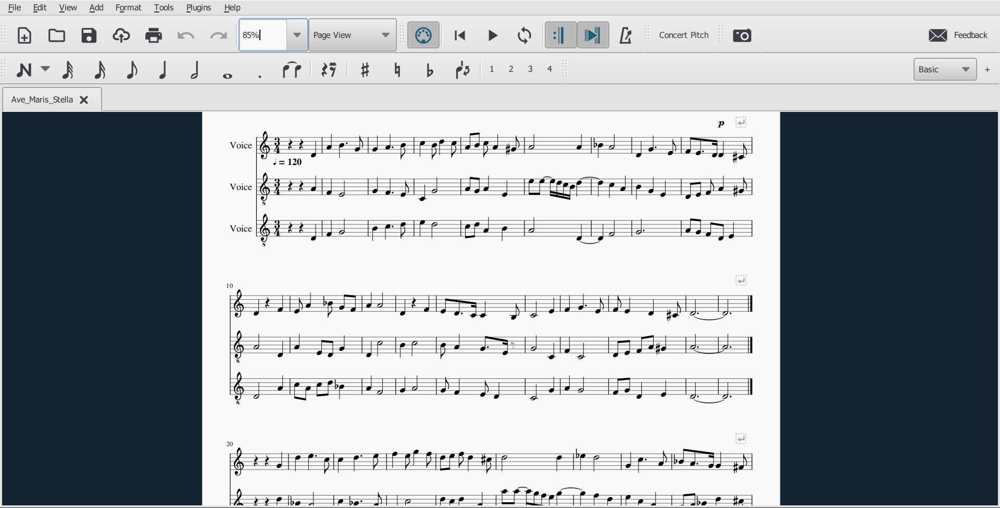

## Week 2: Notation Basics
 
For week 2's task, I converted a PDF file of the sheet music for the medieval hymn "Ave Maris Stella" in to MuseScore. I then corrected any mistakes that the technology made in the conversion process. Here is a screenshot of the PDF converted into Musescore:

I noticed a reccurring issue that arised when converting the PDF to Musescore. This was that the stems joining quavers together were sometimes broken instead of connected. The music is still readable and makes sense, so this is more of a stylistic issue.
 
