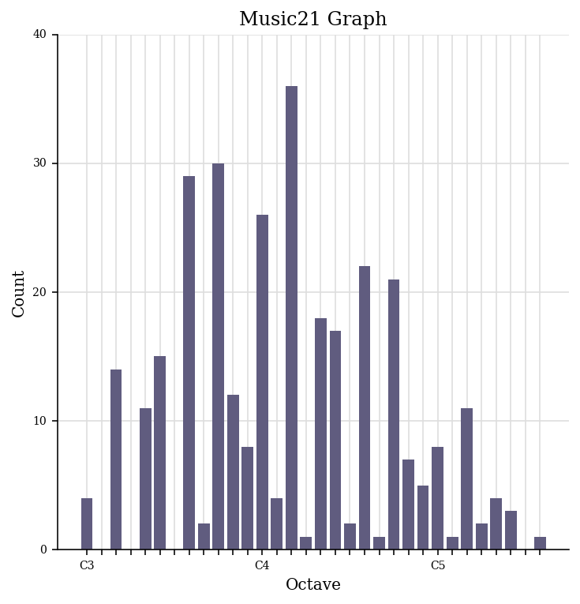

[Week 1](https://olliecargill.github.io/MCA-2022) | [Week 2](https://olliecargill.github.io/MCA-2022/labtasks/week2/week2.html) | [Week 3](https://olliecargill.github.io/MCA-2022/labtasks/week3/week3.html) | [Week 4](https://olliecargill.github.io/MCA-2022/labtasks/week4/week4.html) | [Week 5](https://olliecargill.github.io/MCA-2022/labtasks/week5/week5.html) | [Week 7](https://olliecargill.github.io/MCA-2022/labtasks/week7/week7.html) | [Week 8](https://olliecargill.github.io/MCA-2022/labtasks/week8/week8.html) | [Week 9](https://olliecargill.github.io/MCA-2022/labtasks/week9/week9.html) | [Week 10](https://olliecargill.github.io/MCA-2022/labtasks/week10/week10.html)

# Ollie Cargill's MCA Project: Medieval Music

## Week 4: Computational Analytics of Notated Music
### 1. jsymbolic Analysis
* For this week's task, I generated a jSymbolic analysis of Ave Maris Stella. I selected a number of features to analyse and opened these in an Excel file to view them. Here is a screenshot of the Excel file showing the jSymbolic analysis.

* Here is a link to the [CSV file](Ave_Maris_Stella_jSymbolic_VALUES.csv)

Feature | Value                                                       
------- | -------                                                      
Number of pitches | 28                                                                           
Number of pitch classes | 12
Range | 31
Strong tonal centres | 1
Mean pitch | 60.92
Mean pitch class | 5.198
Most common pitch | 62 
Most common pitch class | 2
Interval between most prevelant pitches | 5
Pitch variability | 6.927
Most common melodic interval | 2
    
* Some conclusions we can draw from this information are:the most common pitch is a D4, as the MIDI value for D4 is 62. This is reflected in the pitch histogram further down, which also shows that D4 is the most common pitch. We also know that there are 31 semitones between the highest and the lowest pitch in the piece, as demonstarted by the Range feature. We also know that the most common distance between two notes is 2 semitones. The 'most common melodic interval' feature tells us this.

### 2. music21: Piano roll, Scatterplot & Pitch histogram

### Piano roll

* This is a piano roll of the first 10 bars or 30 notes of the piece. It shows the order of notes played (reading from left to right), the pitch of the note played (from the Y-axis) and the length of the note played (from the X-axis) over these first 10 bars. 

### Scatterplot

* This scatterplot shows the relationship between the pitches in the piece and their lengths. From this we know that the most common note lengths are quarter notes (crotchets) and eighth notes (quavers). This is because the most plots are on the 0.5 and 1.0 values on the X-axis, which represents quarter length notes. The more transparent plots have fewer notes of that pitch that are that length. The more opaque plots have many notes of that pitch are that length. 

### Pitch histogram

* This shows the number of pitches in the piece ranging from C3 to G5. From this histogram, we can determine that there are 30 A3s for example. We can also see that there are many Gs, As, Ds and Cs, so this could give us a good indication of the key of the piece which we know is C major. You can also draw an indication on how high or low the piece is from the histogram. By looking at the frequency of pitches, we can see that the piece centres mostly around D4, so is mid-range. The most common pitches range between G3 and A4. This means the piece mostly stays in roughly 1 octave.

<a href="https://olliecargill.github.io/MCA-2022/labtasks/week3/week3.html"><--Week 3</a> 
<a href="https://olliecargill.github.io/MCA-2022/labtasks/week5/week5.html">Week 5 --></a> 

