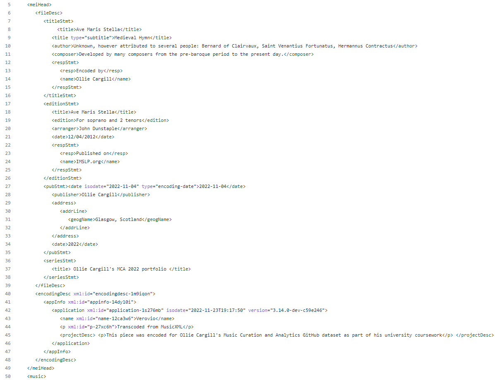

[Week 1](https://olliecargill.github.io/MCA-2022) | [Week 2](https://olliecargill.github.io/MCA-2022/labtasks/week2/week2.html) | [Week 3](https://olliecargill.github.io/MCA-2022/labtasks/week3/week3.html) | [Week 4](https://olliecargill.github.io/MCA-2022/labtasks/week4/week4.html) | [Week 5](https://olliecargill.github.io/MCA-2022/labtasks/week5/week5.html) | [Week 7](https://olliecargill.github.io/MCA-2022/labtasks/week7/week7.html) | [Week 8](https://olliecargill.github.io/MCA-2022/labtasks/week8/week8.html) | [Week 9](https://olliecargill.github.io/MCA-2022/labtasks/week9/week9.html) | [Week 10](https://olliecargill.github.io/MCA-2022/labtasks/week10/week10.html)

# Ollie Cargill's MCA Project: Medieval Music

## Week 5: Standards in Curation

* For this week's task I added metadata to my MEI file. This shows what my MEI file looked like before and after the metadata was added to the mei header.

<table class="screenshots">
  <tr>
    <td class="text-table">Before metadata</td>
    <td class="text-table">After metadata</td>
  </tr>
  <tr>
    <td class="text-table"></td>
    <td class="text-table"></td>
  </tr>
  </table>

### Metadata added to the File Description (fileDesc)

* In the <i>titleStmt</i>, I added a title and subtitle. I also added the name of the encoder (myself in this case) in the <i>respStmt</i> within the <i>titleStmt</i>.
* Within the <i>editionStmt</i> I added information about the edition of the hymn I used which was from IMSLP.org. I added the arranger's name, the date the arrangement was uploaded and what voices the arrangement was written for. I included where it was published (IMSLP) within the <i>respStmt</i> tag. 
* Within the <i>pubStmt</i> I added the date in which the piece was encoded into verovio, my name as the publisher, the location of publishing and the date of publishing.
* Within the <i>seriesStmt</i> I added a title (Ollie Cargill's MCA 2022 portfolio) to indicate the name of the dataset that the piece is now encoded in. 

### Metadata added to the Encoding Description (encodingDesc)

* In the <i>projectDesc</i> I added a brief description of why the piece was encoded.

* The updated MEI file including the metadata can be found here: 

<a href="https://olliecargill.github.io/MCA-2022/labtasks/week4/week4.html"><--Week 4</a> 
<a href="https://olliecargill.github.io/MCA-2022/labtasks/week7/week7.html">Week 7 --></a> 

