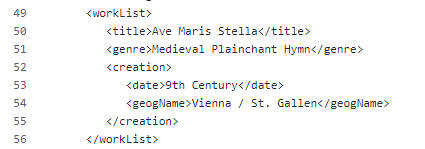
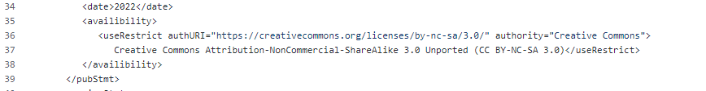
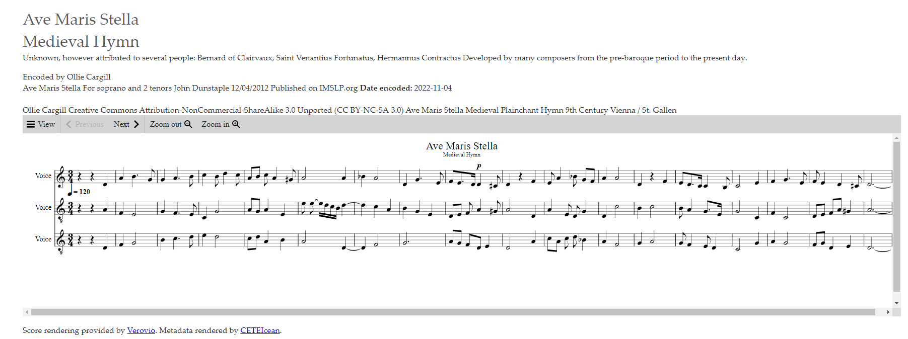

[Week 1](https://olliecargill.github.io/MCA-2022) | [Week 2](https://olliecargill.github.io/MCA-2022/labtasks/week2/week2.html) | [Week 3](https://olliecargill.github.io/MCA-2022/labtasks/week3/week3.html) | [Week 4](https://olliecargill.github.io/MCA-2022/labtasks/week4/week4.html) | [Week 5](https://olliecargill.github.io/MCA-2022/labtasks/week5/week5.html) | [Week 7](https://olliecargill.github.io/MCA-2022/labtasks/week7/week7.html) | [Week 8](https://olliecargill.github.io/MCA-2022/labtasks/week8/week8.html) | [Week 9](https://olliecargill.github.io/MCA-2022/labtasks/week9/week9.html) | [Week 10](https://olliecargill.github.io/MCA-2022/labtasks/week10/week10.html)

# Ollie Cargill's MCA Project: Medieval Music

## Week 7: Challenges to Music Curation

### 1. Revising the MEI file

* For this week's task I revised the metadata in week 5's MEI file by adding a Work Description. In <i>workList</i> I added information about the genre and where / when the original piece was written. Here is what this looks like in the mei file:

* I then added a Creative Commons license to my transcribed piece and coded this into the MEI file. I chose to add the CC BY-NC-SA 3.0 license because this is the license that the original piece has on IMSLP. This allowed me to redistribute the material and adapt/build-upon the material for my portfolio. However with this license I am not allowed to commercialise on the redistributed material. I also had to pick this because if I redistribute material that has this license in the first place, then the new material must retain the license. This is known as ShareAlike (SA). I must also give appropriate credit to the original creator (Attribution) which I have done by adding metadata to the MEI file. Here is a link to the [Creative Commons license.](https://creativecommons.org/licenses/by-nc-sa/3.0/) Here is what this looks like in the MEI file:

* Here is the link to the updated [MEI file.](https://github.com/OllieCargill/MCA-2022/blob/master/data/Ave_Maris_Stella_Week7.mei)

### 2. Rendering the metadata and score on an HTML page

* For the next task I used CSS to format the metadata in a readable and organised manner on the Verovio render. Here is what the metadata looked like before I formatted it using CSS:

* Here is the Verovio render that has been formatted using CSS:

* Here is a link to the [CETEIcean.css file.](https://github.com/OllieCargill/MCA-2022/blob/master/css/CETEIcean.css)

<a href="https://olliecargill.github.io/MCA-2022/labtasks/week5/week5.html"><--Week 5</a> 
<a href="https://olliecargill.github.io/MCA-2022/labtasks/week8/week8.html">Week 8 --></a> 

