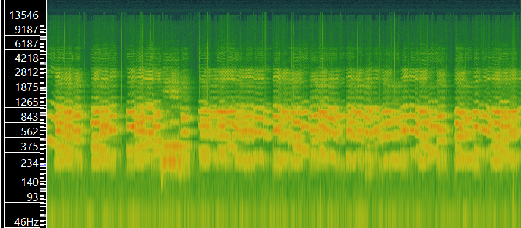
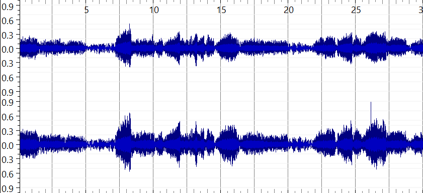
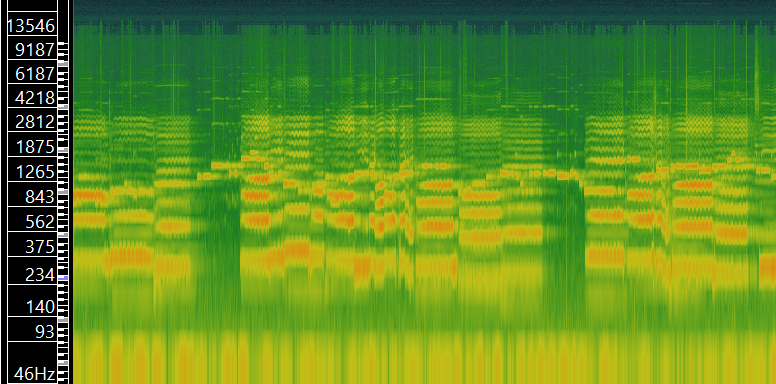
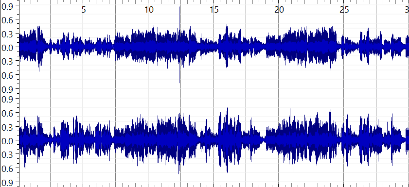
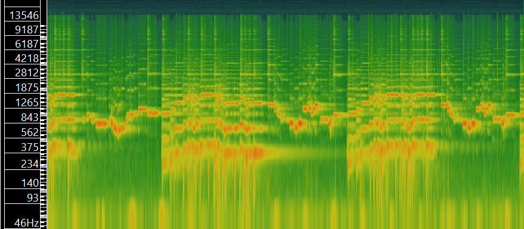

[Week 1](https://olliecargill.github.io/MCA-2022) | [Week 2](https://olliecargill.github.io/MCA-2022/labtasks/week2/week2.html) | [Week 3](https://olliecargill.github.io/MCA-2022/labtasks/week3/week3.html) | [Week 4](https://olliecargill.github.io/MCA-2022/labtasks/week4/week4.html) | [Week 5](https://olliecargill.github.io/MCA-2022/labtasks/week5/week5.html) | [Week 7](https://olliecargill.github.io/MCA-2022/labtasks/week7/week7.html) | [Week 8](https://olliecargill.github.io/MCA-2022/labtasks/week8/week8.html) | [Week 9](https://olliecargill.github.io/MCA-2022/labtasks/week9/week9.html) | [Week 10](https://olliecargill.github.io/MCA-2022/labtasks/week10/week10.html)

# Ollie Cargill's MCA Project: Medieval Music

## Week 8: Music as Sound

The three tracks I have selected are from the album <i>Thirteenth-Century Polyphony (Early Medieval Music)</i> available from: [archive.org](https://archive.org/details/lp_thirteenth-century-polyphony-early-medieva_archibald-t-davison-willi-apel-the-univers/disc1/02.05.+Aucun+%E2%80%92+Lonc+Tans+%E2%80%92+Annuntiantes+(de+Cruce).mp3).

I selected the tracks titled <i>Hec Dies (3-voice Organum), Aucun - Lonc Tans - Annuntiantes (de Cruce) and Monophonic Dances: Danse Royale; Danse Royale; English Dance.</i> I thought it would be interesting to see how an organum would look in SonicVisualiser compared to a monophonic piece, hence why I have selected these two specifically. <i>Aucun</i> was selected because it features both voice and instrument, whereas the others feature solely instruments or solely voice. I thought it would be interesting to pick three varied pieces.  

### Hec Dies

#### Metadata

Feature | Value
------- | ------
Title | Hec Dies (3-voice Organum)
Artist | Steven Crockett, Robert Heinrickson, Roger Weiss
Composer | Leonin (unconfirmed)
Copyright Info | ℗ 1975 Southern Illinois University Press
Genre | Early Medieval, a cappella 
Source | [archive.org](https://archive.org/details/lp_thirteenth-century-polyphony-early-medieva_archibald-t-davison-willi-apel-the-univers/disc1/01.13.+Hec+Dies+(3-voice+Organum).mp3)
File/Audio Format | mp3 (originally an LP)
Number of Channels | 2
Sample Rate | 48000Hz
Bits per Second | 171kbps
Duration | 00:30

#### Waveform

#### Spectrogram

### Aucun

#### Metadata

Feature | Value
------- | ------
Title | Aucun - Lonc Tans - Annuntiantes (de Cruce)
Artist | Robert Heinrickson, Howard M. Brown, David Eisenbud
Composer | Petrus de Cruce
Copyright Info | ℗ 1975 Southern Illinois University Press
Genre | Early Medieval, song 
Source | [archive.org](https://archive.org/details/lp_thirteenth-century-polyphony-early-medieva_archibald-t-davison-willi-apel-the-univers/disc1/02.05.+Aucun+%E2%80%92+Lonc+Tans+%E2%80%92+Annuntiantes+(de+Cruce).mp3)
File/Audio Format | mp3 (originally an LP)
Number of Channels | 2
Sample Rate | 48000Hz
Bits per Second | 174kbps
Duration | 00:30

#### Waveform

#### Spectrogram

### Monophonic Dances

#### Metadata

Feature | Value
------- | ------
Title | Monophonic Dances: Danse Royale; Danse Royale; English Dance
Artist | Howard M. Brown, Benjamin Choi, Laurence Libin, Anne MacWilliams, Michael Shapiro, Helen Walker
Composer | Unknown
Copyright Info | ℗ 1975 Southern Illinois University Press
Genre | Early Medieval, Instrumental, Dance
Source | [archive.org](https://archive.org/details/lp_thirteenth-century-polyphony-early-medieva_archibald-t-davison-willi-apel-the-univers/disc1/02.13.+Monophonic+Dances%3A+Danse+Royale%3B+Danse+Royale%3B+English+Dance.mp3)
File/Audio Format | mp3 (originally an LP)
Number of Channels | 2
Sample Rate | 48000Hz
Bits per Second | 174kbps
Duration | 00:30

#### Waveform

#### Spectrogram

One advantage of a time-frequency analysis over a waveform-based analysis is that time-frequency analyses are easier to read and thus gather information from. They are more comprehensible than waveforms, which tend to be difficult to extract information from at a glance, as they are extremely information dense. From an initial look at a waveform, one might only be able to determine how loud the audio is at certain points from the height of the waves, and how this changes throughout the song. However, a spectrogram can provide more information on pitch for example. If we look at the example from <i>Monophonic Dances</i> we can see from the waveform that there is repetition in the song, as a pattern can be seen in the waves. However, anything beyond the fact that there is a pattern and the dynamics is unknown from looking at the waveform. If we look at the spectrogram, this pattern is visable like in the waveform, but the Y-axis tells us the frequency, and therefore we can determine the relevant pitch. So from a time-frequency analysis we can work out melody and perhaps the key of the piece, giving us more information than a waveform. 
