[Week 1](https://olliecargill.github.io/MCA-2022) | [Week 2](https://olliecargill.github.io/MCA-2022/labtasks/week2/week2.html) | [Week 3](https://olliecargill.github.io/MCA-2022/labtasks/week3/week3.html) | [Week 4](https://olliecargill.github.io/MCA-2022/labtasks/week4/week4.html) | [Week 5](https://olliecargill.github.io/MCA-2022/labtasks/week5/week5.html) | [Week 7](https://olliecargill.github.io/MCA-2022/labtasks/week7/week7.html) | [Week 8](https://olliecargill.github.io/MCA-2022/labtasks/week8/week8.html) | [Week 9](https://olliecargill.github.io/MCA-2022/labtasks/week9/week9.html) | [Week 10](https://olliecargill.github.io/MCA-2022/labtasks/week10/week10.html)

# Ollie Cargill's MCA Project: Medieval Music

## Week 9: Analysing and Extracting Meaning from Audio

* For this week's task I selected three sample tracks from the album <i>Music for a Medieval Day</i> available from [Archive.org](https://archive.org/details/lp_music-for-a-medieval-day_alfonso-x-el-sabio-anonymous-guillaume-de/disc1/01.10.+Sumer+Is+Icumin+In.mp3) The tracks I have selected are: <i>Douce Dame Jolie</i>, <i>De Triste Cuer</i> and <i>Sumer is Icumin In</i>.

### Douce Dame Jolie

#### Spectrogram, Chromagram and MFCC

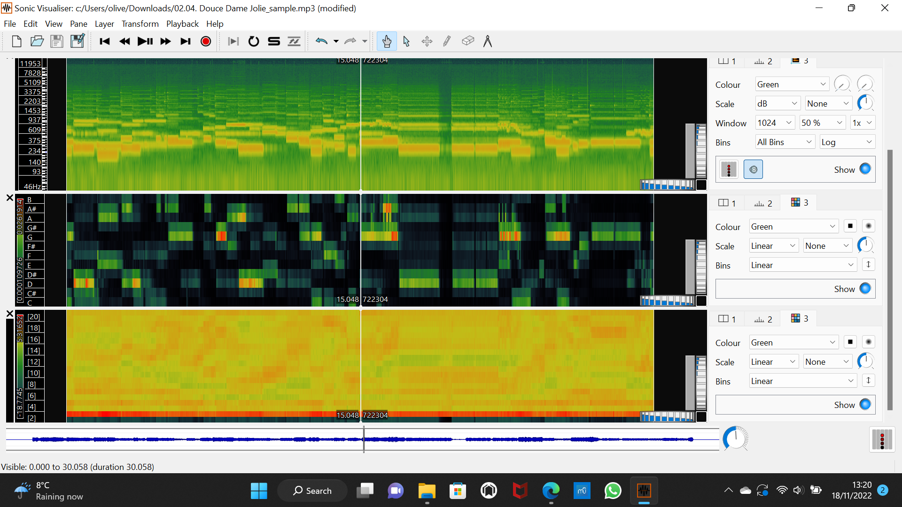

#### CSV files

* [Spectrogram](doucespectrogram.csv)
[Chromagram](doucechromagram.csv)
[MFCC](doucemfcc.csv)

### De Triste Cuer

#### Spectrogram, Chromagram and MFCC

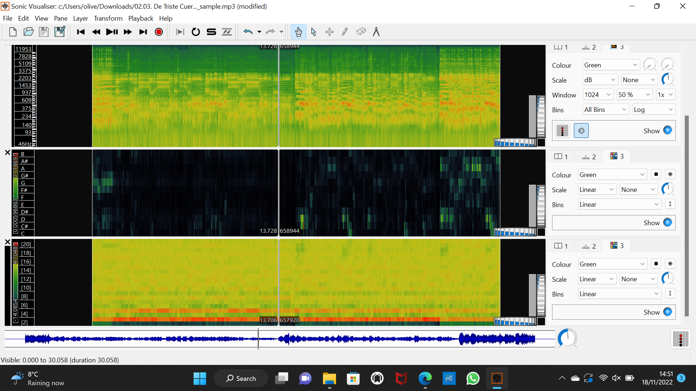

#### CSV files

* [Spectrogram](detristespectrogram.csv)
[Chromagram](detristechromagram.csv)
[MFCC](detristemfcc.csv)

### Sumer is Icumin In

#### Spectrogram, Chromagram and MFCC

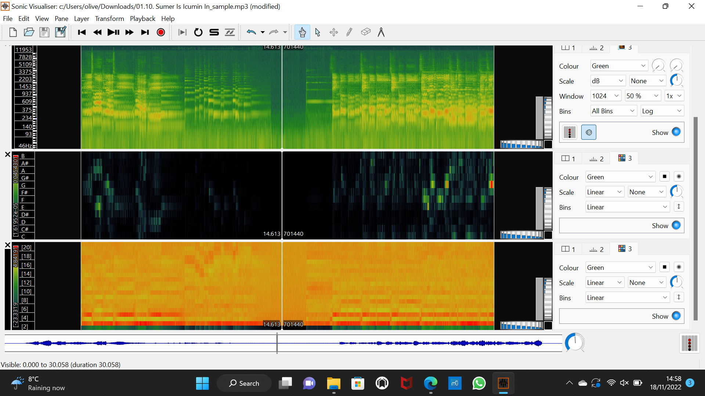

#### CSV files

* [Spectrogram](sumerspectrogram.csv)
[Chromagram](sumerchromagram.csv)
[MFCC](sumermfcc.csv)

### Histograms 

* I then created histograms of the chromagrams, spectrograms and MFCCs of each piece using Jupyter Notebooks. Here are the histograms:
              
#### Chromagrams

<table class="screenshots">
  <tr>
    <td class="text-table"> <strong>Douce Dame Jolie</strong> </td>
    <td class="text-table"> <strong>De Triste Cuer</strong> </td>
    <td class="text-table"> <strong>Sumer is Icumin In</strong> </td>
  </tr>
  <tr>
    <td class="text-table"> 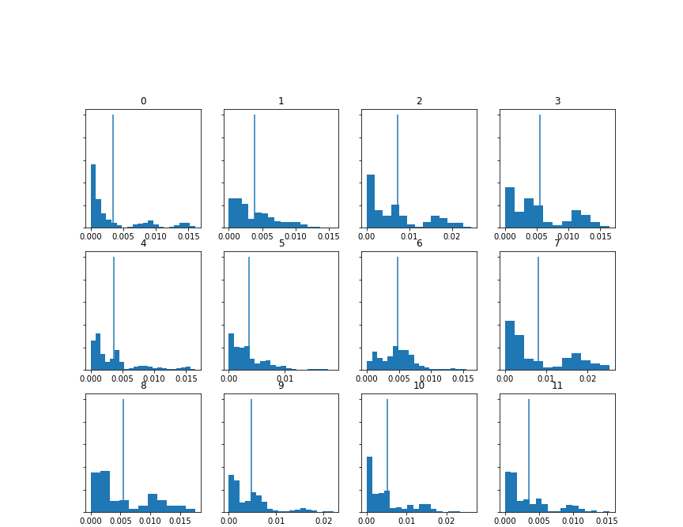 </td>
    <td class="text-table"> 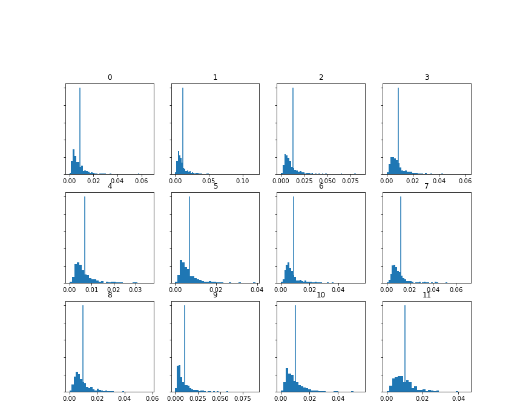 </td>
    <td class="text-table"> 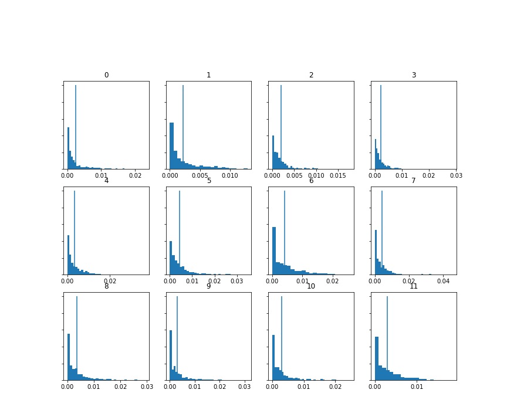 </td>
  </tr>
  </table>

#### Spectrograms

<table class="screenshots">
  <tr>
    <td class="text-table"> <strong>Douce Dame Jolie</strong> </td>
    <td class="text-table"> <strong>De Triste Cuer</strong> </td>
    <td class="text-table"> <strong>Sumer is Icumin In</strong> </td>
  </tr>
  <tr>
    <td class="text-table"> 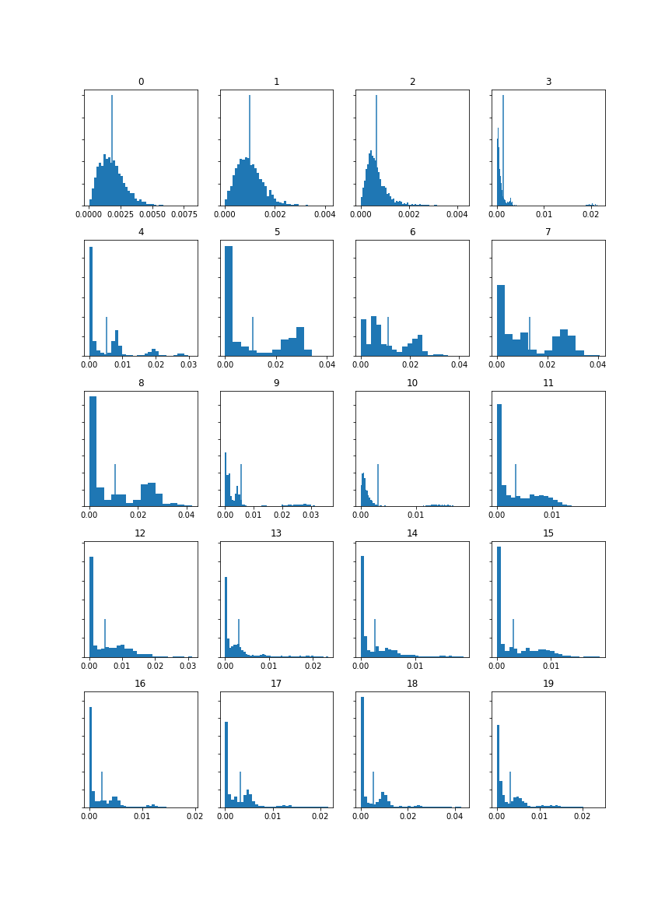 </td>
    <td class="text-table"> 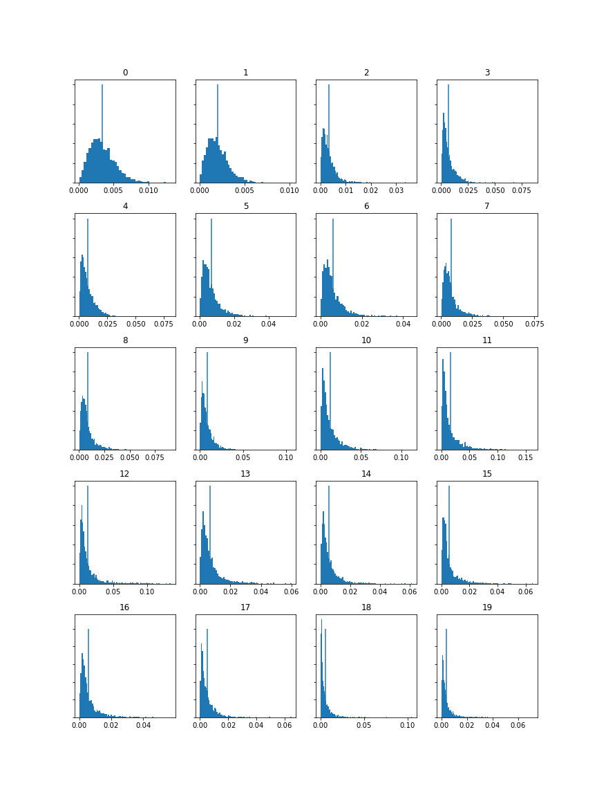 </td>
    <td class="text-table"> 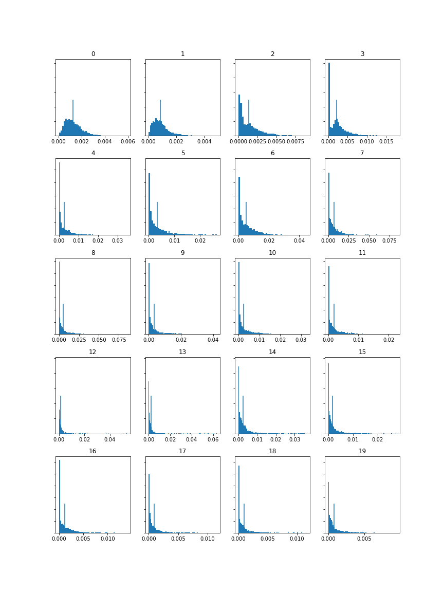 </td>
  </tr>
  </table>
  
 #### MFCCs

<table class="screenshots">
  <tr>
    <td class="text-table"> <strong>Douce Dame Jolie</strong> </td>
    <td class="text-table"> <strong>De Triste Cuer</strong> </td>
    <td class="text-table"> <strong>Sumer is Icumin In</strong> </td>
  </tr>
              <tr>
                <td class="text-table"> 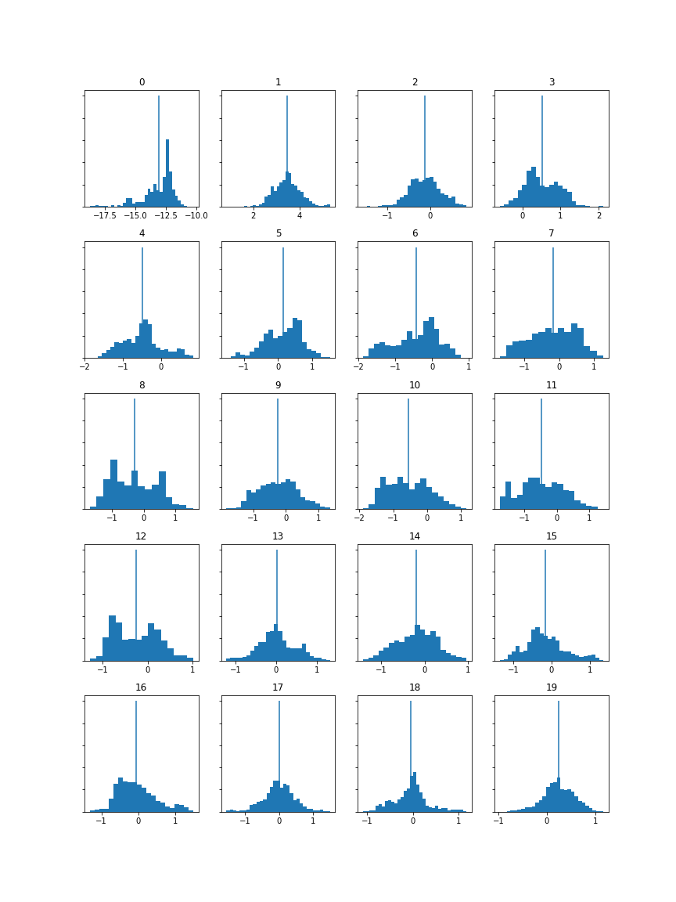 </td>
                <td class="text-table"> 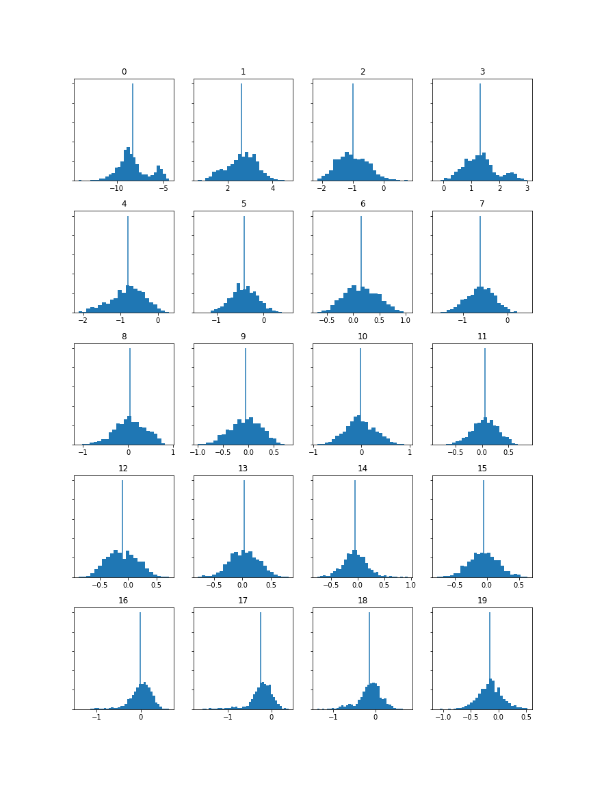 </td>
                <td class="text-table"> 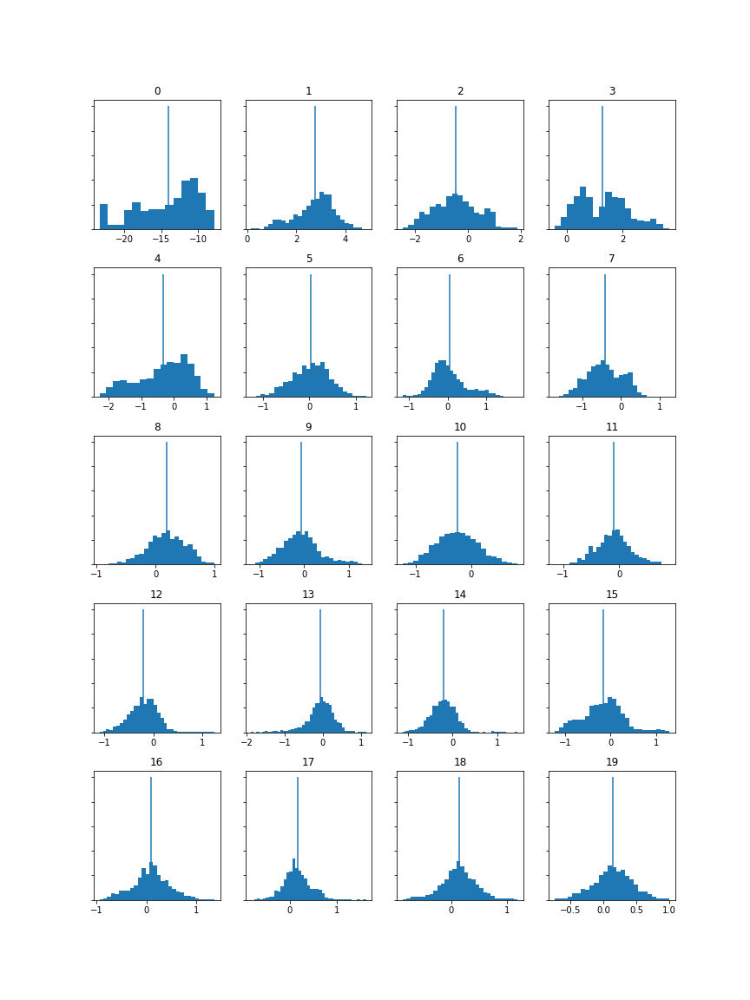 </td>
  </tr>
  </table>

* These MFCCs show...

<a href="https://olliecargill.github.io/MCA-2022/labtasks/week8/week8.html"><--Week 8</a> 
<a href="https://olliecargill.github.io/MCA-2022/labtasks/week10/week10.html">Week 10 --></a> 

